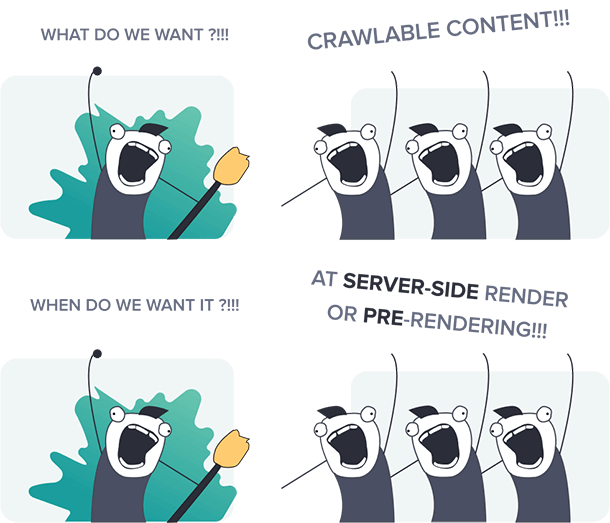

# Single-Page Application in Vue.js

Some applications require rich interactivity, deep session depth, and non-trivial stateful logic on the frontend. The best way to build such applications is to use an architecture where Vue not only controls the entire page but also handles data updates and navigation without having to reload the page. This type of application is typically referred to as a Single-Page Application (SPA).

In short, a single-page application is an app that doesn't need to reload the page during its use and works within a browser.



I have a sample Single-Page Application built with Vue.js.

Our goal here is to Dockerize this application, push the image to Amazon Elastic Container Registry (ECR), and deploy it using Amazon Elastic Container Service (ECS) Fargate, attaching an Elastic Load Balancer (ELB) and Auto Scaling Group (ASG).

I initially attempted to use a single-stage Dockerfile but encountered a 404 error when launching a new container because the application wasn't running in the container. This issue led me to employ a multi-stage Dockerfile, which worked perfectly. Here is the Dockerfile:

```Dockerfile
# Build stage
FROM node:lts-alpine as build-stage
WORKDIR /app
COPY . .
RUN npm cache clean --force
RUN npm install --legacy-peer-deps
RUN npm run build

# Production stage
FROM nginx:stable-alpine as production-stage
COPY --from=build-stage /app/dist /usr/share/nginx/html
COPY ./nginx/default.conf /etc/nginx/conf.d/default.conf
EXPOSE 80
CMD ["nginx", "-g", "daemon off;"]
```

This approach also reduces the size of the image significantly.

To verify if it's working or not, execute the following commands:

```bash
sudo docker build -t vueimagejs .
```

Now, to run a container:

```bash
sudo docker container run -d -p 8081:80 vueimagejs
```

Verify by running:

```bash
curl localhost:8081
```

Or simply open `localhost:8081` in your browser.

Next, create a repository in Amazon Elastic Container Registry (ECR):

1. Install the AWS Command Line Interface (CLI) if you haven't already:

   ```bash
   sudo apt install awscli
   ```

2. Configure the AWS CLI:

   ```bash
   aws configure
   ```

3. Provide the credentials for a user with ECS access to create a repository in ECR:

   ```bash
   aws ecr create-repository --repository-name <repo_name> --region <region_name>
   ```

4. In the ECR console, select your repository and click "View push commands."

Proceed to the ECS console:

1. Create a task definition. 

   - Provide a name.
   - Select AWS Fargate.
   - Choose the OS as Linux.
   - Specify the CPU (e.g., 1vCPU) and Memory (e.g., 3GB).
   - Leave the Task role and Task Execution Role as default.

2. Configure the container details:

   - Name.
   - Image URI from ECR.
   - Port mapping details.
   - CPU, GPU, Memory hard limit, and Memory soft limit.

3. Define Environment Variables as needed.

4. Leave the rest as default and create the task definition.

Proceed to the creation of an Amazon ECS Cluster:

1. Provide your Cluster Name.
2. Select Infrastructure as Fargate.

Now, create an Elastic Load Balancer:

1. Create a service with your desired configuration.
2. Select the Load Balancer you created and set up the Target Group.

Now, go to the ECS Clusters and Create the service with the desired configuration.

However, you might encounter a `404 error` when you hit the DNS of Load Balancer like /about or /anything and try to reload the page. This happens because single-page applications do not have server-side rendering. To resolve this, you can use a location block in the NGINX configuration file. Here's the configuration:

```nginx
server {
    listen 80;
    server_name localhost;
    root /usr/share/nginx/html;
    index index.html index.htm;

    location / {
        try_files $uri $uri/ /index.html;
    }
}
```
`try_files` tests for the existence of the file in the local file system and may rewrite the URL, if it does exist, it only remembers it - and continues processing the rest of the location block.
This configuration ensures that routes are handled by Vue.js and prevents 404 errors.

All of these details are already included in the Dockerfile.

The Dockerfile first builds your Vue.js application and copies the `dist` folder to another NGINX image. It also copies the NGINX conf file to the `/etc/nginx/conf.d/` folder.

With these steps, you can achieve your goal. Feel free to adapt this documentation to your specific requirements and Flask application configuration.

# Thank You

I hope you find this information useful. If you have any doubts about any of the steps, please feel free to contact me. If you encounter any issues or have suggestions for improvement, please let me know.

<!-- [](https://www.linkedin.com/in/gaurav-barakoti-27002223b) -->


<table>
  <tr>
    <th><a href="https://www.linkedin.com/in/gaurav-barakoti-27002223b" target="_blank"><a/></th>
    <th><a href="mailto:bestgaurav1234@gmail.com" target="_blank"><a/>
</th>
  </tr>
</table>


